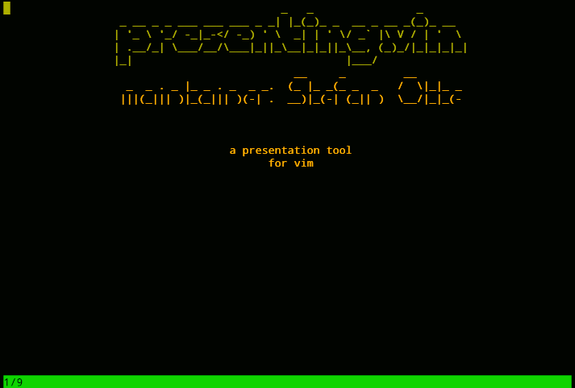

# presenting.vim

**presenting.vim** is a vim plugin that turns your markup into presentable
slides (in vim).

It is a clone of [present.vim][1] which is a clone of [presen.vim][2]. In
contrast to its predecessors, presenting.vim:

  [1]: https://github.com/pct/present.vim
  [2]: https://github.com/sorah/presen.vim

  * has support for common markup languages,
  * can be extended, and
  * is documented

Great, hey?

## Demonstrations
Here is what the `examples/PresentingDemo.rst` file looks like when presented.


Markdown files are rendered a bit more fancifully. Be sure to read the help file. Here is the `examples/PresentingDemo.markdown` being presented.



## Installation

Use [pathogen][3] or [vundle][4] to install presenting.vim.

  [3]: https://github.com/tpope/vim-pathogen
  [4]: https://github.com/gmarik/vundle

## Configuration

Simply write your presentation in your favorite markup language. Every slide
is separated by a markup language specific marker.

|   Filetype   | Slide Separator |
| ------------ | --------------- |
| markdown     | `# heading`     |
| rst          | `~~~~`          |
| orgmode      | `#----`         |
| GoLang slide | `* title`       |


These can be overridden or extended by setting `b:presenting_slide_separator`
for your preferred filetype in your `.vimrc`. For example, set the `.rst` slide
separator to `~~~~` via:

```viml
au FileType rst let b:presenting_slide_separator = '\v(^|\n)\~{4,}'
```

## Usage

When you want to start presenting, execute
```
:PresentingStart
```

It is possible to have multiple presentations running at the same time. Just
run the command in each source document, and each slide show will be
displayed in its own tab.

Once presenting, slide navigation is accomplished via these keys:

| Key | Action         |
| --- | -------------- |
| `n` | next slide     |
| `p` | previous slide |
| `q` | quit           |

## Examples

For examples of presenting.vim presentations, see:

  * [PresentingExample.markdown](https://github.com/sotte/presenting.vim/blob/master/examples/PresentingDemo.markdown)
  * [PresentingExample.rst](https://github.com/sotte/presenting.vim/blob/master/examples/PresentingDemo.rst)
  * [PresentingExample.org](https://github.com/sotte/presenting.vim/blob/master/examples/PresentingDemo.org)
  * [PresentingExample.slide](https://github.com/sotte/presenting.vim/blob/master/examples/PresentingDemo.slide)

Of course you can configure the slide separators.

## Contributing

The [code][5] and [issue tracker][6] are on github. Pull requests are welcome!

  [5]: https://github.com/sotte/presenting.vim
  [6]: https://github.com/sotte/presenting.vim/issues
